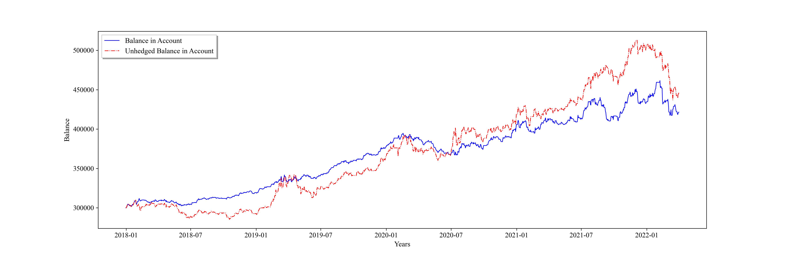

# Low Price and Low Premium Ratio Convertible Bonds

## Why I did this?

As a kind of bonds, the payment of principal and interest of convertible bonds is the protection of its price, which means that the space for drawdown of convertible bonds is limited, and we can buy for rising elasticity.  
Thanks to the elasticity of convertible bonds portfolio, it has 'Alpha' from time to time. Therefore, I came up with a simple idea that a convertible bonds portfolio could be hedge by stock index future maybe.

## Method

- At the end of the month (denotes ), compute 'double low' index (I set  and );
- Select the lowest  bonds and wait;
- The selected bonds should meet the following conditions:1) at lease 30 million outstanding balance; 2) at least 365 days left; 3) ranks AA or above; 
- Specifically, at the end of each month, we have  bonds, and then we sell those in the position but not in  at close price and buy the new bonds in  on the first trade day the next month at the average price;
- Note that convertible bonds might have the situation where clause reset, redemption and re-purchase happens, and I prefered to sell those convertible bonds once the redemption warning was published; 
- In the hedged version, I used the stock index future (IC consecutive next month) to hedge. To simplify, I just bought and sold future to cover convertible bond position on a daily basis, and did not buy and sell convertible bonds. Moreover, I also assumed that I can buy stock index future in decimal.

## Params Setting

- buy cost: 0.0003
- sell cost: 0.0013
- future multiplier: 200
- initial balance: CNY 300000
- start date: 12/31/2017
- end date: 04/05/2022

## Results

As a method of single factor, it was effective to an extend. The unhedged version shows a feature of elasticity, while the hedged version is much more stable.  

.png)

|                  | Shapre | annual return | Max Drawdown |
| ---------------- | ------ | ------------- | ------------ |
| Hedged Version   | 0.5671 | 7.91%         | -9.01%       |
| Unhedged Version | 0.4791 | 10.04%        | -20.75%      |

## Defects and Improvements

- We should buy and sell stock index future in integer, which means the hedge effect would be much worse (Maybe)
- Convertible bond market is not that large, if we want to hedge in the real world
- We want to hedge the risk of convertible bond market,  but I used stock index future
